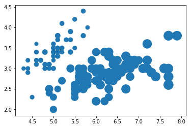
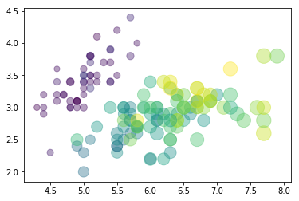

# Estatística descritiva com Pandas (Python)

Implementação no contexto de Data Science utilizando a biblioteca Pandas (Python)

## Medidas de Tendência Central

As medidas de tendência central definem valores significativos, representativos e adequados para um conjunto de dados, dependendo do que se deseja analisar. São elas a média, mediana, quantis e a moda.

### Média

A média é uma medida de tendência central que indica o valor onde estão concentrados os dados de um conjunto de valores, representando um valor significativo para o mesmo.

### Mediana e Quantil

A mediana é o valor que separa a metade superior da metade inferior de uma distribuição de dados, ou o valor no centro da distribuição. Na prática, se o número de observações na distribuição é ímpar, ele é o valor central, e se o número de observações é par, ele será a média das duas observações mais centrais.

### Moda

A moda é simples. Nada mais é que o valor que mais se repete dentro de um conjunto. No Pandas, a moda é calculada através da função mode().

## Medidas de Dispersão

As medidas de dispersão são medidas que indicam o quão espalhados os dados estão, ou como eles variam. São elas a amplitude, a variância, o desvio padrão e o desvio absoluto.

### Amplitude

A amplitude nada mais é do que a diferença entre o maior e o menor valor de um conjunto de dados.

### Variância

A variância é uma medida que expressa quanto os dados de um conjunto estão afastados de seu valor esperado. Calculamos a variância no Pandas através da função var().

### Desvio Padrão

O desvio padrão também é uma medida de dispersão, que indica quanto os dados estão afastados da média. Um valor de desvio padrão alto indica que os valores estão mais espalhados, mais longe da média, e um desvio padrão baixo indica que os valores estão mais próximos da média.

### Desvio absoluto

O Desvio Absoluto é calculado da seguinte forma: primeiro, encontramos a média dos valores; depois, calculamos a distância de cada ponto desta média; somamos as distâncias e dividimos o resultado pela média destas distâncias.

### Covariância e Correlação

Em alguns momentos, queremos saber se duas variáveis possuem alguma relação entre si dentro de um conjunto de dados. Para estes casos, calculamos a covariância e a correlação.

A covariância é uma medida numérica que indica a inter-dependência entre duas variáveis. A covariância indica como duas variáveis se comportam conjuntamente em relação às suas médias. Uma covariância igual a 0 indica que as duas variáveis são totalmente independentes, enquanto que uma covariância alta e positiva indica que uma variável é grande quando a outra é grande. Analogamente, uma covariância negativa e com valor absoluto alto indica que uma variável é pequena quando a outra é grande. A covariância pode ser calculada no Pandas através da função cov().

